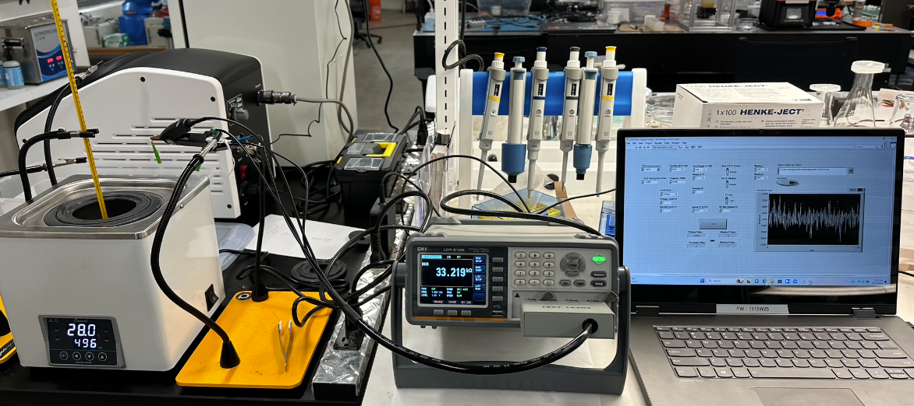
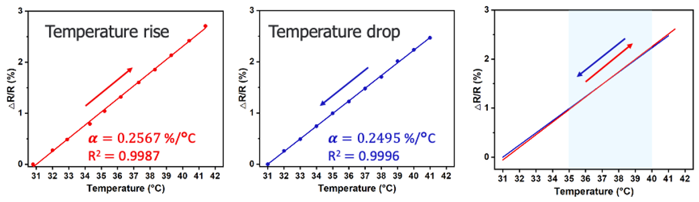
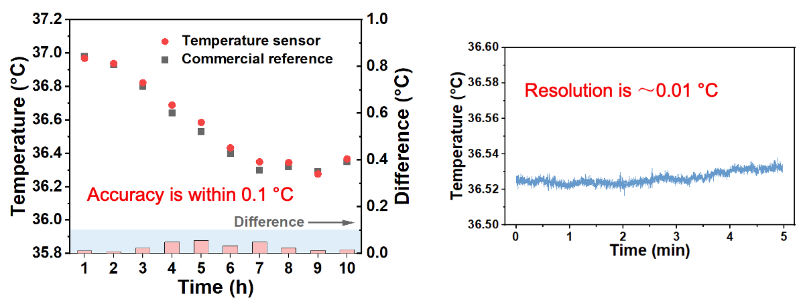

# Temperature Sensor Calibration and Characterization

*The setup of temperature sensor calibration and characterization*

*Calibration curve of temperature sensor resistance change versus temperature change*

*The accuracy and resolution test of the temperature sensor after calibration*
