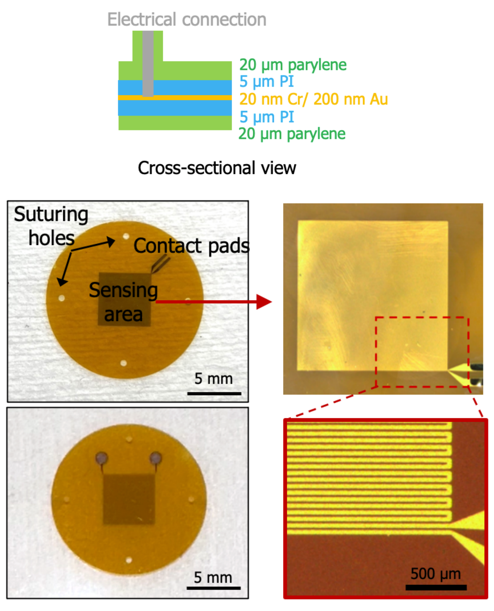

# NEST 5 – Temperature Sensor Design and Fabrication

## NEST 5 – Temperature Sensor Fabrication Protocol

## 1. Deposit the Sacrificial Layer and Base Polyimide

### 1.1 Sputtering Copper as Sacrificial Layer

*Materials:* 4” prime silicon wafer(s)

*Note: Before sputtering, silicon wafers must be cleaned with acetone and IPA.*

*Equipment:* KJL Sputter

The sputtering time is 1800s, Sputter Deposition Rate is 150 Å/min. The thickness of copper is about 150 nm.

### 1.2 Polyimide Deposition of the Base Layer

*Materials:* Polyimide: PI2545 Monomer

*Equipment:* Hot plate and Vacuum Heating Chamber

1. First, the PI2545 monomer is removed from the refrigerator and placed at room temperature for half an hour to ambient temperature, and the whole process is operated in a clean room.
2. A 5 μm PI layer was prepared using a spin coating operation. In detail, about 10 ml of PI monomer was poured onto the center of the silicon wafer, and the spin coating was controlled at 1100 rpm with an acceleration of 500 for 30 s. Subsequently, it was treated at 110 °C for 2 min and at 150 °C for 3 min. Finally, it was transferred to a vacuum-heated chamber at 260 °C for 1 hour. Cool down all night.

## 2. Deposit and Pattern Metal

### 2.1 Deposition, Exposure, and Development of Photoresist

*Note: The Polyimide surface needs to be cleaned with acetone and IPA.*

*Materials:* AZ nLOF 2035 resist

*Equipment:* Hot plate and Mask aligner (MAB6)

1. Metal patterns are defined using the Lift-off process. Spin coat AZ nLOF 2035 resist (negative) at 4000 rpm (~3 µm) for 60 s, and bake at 110 °C for 60 s.
2. Expose (365 nm) using a dose of 80 mJ/cm².
3. Post-bake at 110 °C for 60 s.
4. Develop using AZ 917 MIF for about 60 s, then check patterned PR using a microscope.
   - *Note: If the photoresist thickness is not within the range of 3-4 µm, the speed must be recalibrated. The photoresist thickness can be measured after development is complete. If the photoresist is not applied correctly (e.g., if there is not enough photoresist used to cover the entire wafer or if a particle is stuck on the surface), remove the photoresist and return to step 2.1.*

### 2.2 Deposit Metals

*Materials:* Titanium and Platinum

*Equipment:* CHA E-beam evaporator

1. Deposit the metal stack up (20 nm Cr (adhesion layer) + 200 nm Au) at 1 Å/s.
   - *Note: Wait 30 minutes between different types of metal to allow the crucible to cool down.*
   - *Note: Pause for 30 minutes after each 50 nm of gold (i.e. deposit in three 50 nm runs with 30 min pauses between each run).*

### 2.3 Pattern Metal via Lift-off

*Materials:* NMP rinse and Acetone

*Equipment:* Glass dishes designated for liftoff, Sonicating bath, and Stereoscope

*Note: All steps (2.3) are performed one wafer at a time; repeat the following procedure once for each wafer.*

1. Hold the NMP bath (with the wafer inside) above the sonicating bath and intermittently touch the water surface for intermittent sonication until the metal appears to be fully lifted off.
2. Once the liftoff appears to be complete, move the NMP bath back to the hot plate and transfer the wafer to a room-temperature NMP bath for more than 5 minutes.
   - Do not allow the wafer to dry, as this will cause the lifted-off metal to permanently stick to the wafer surface.
3. Lift the wafer out of the room temperature NMP bath, rinse it with NMP using a squeeze bottle, and move it to an IPA bath for more than 5 minutes.
   - Do not allow the wafer to dry, as this will cause the lifted-off metal to permanently stick to the wafer surface.
4. Inspect the wafer for any remaining metal while submerged in acetone under a stereoscope.
   - If any undesired metal remains (metal that has not yet been lifted off or metal flakes sitting on the surface), move the wafer back to the warm NMP bath and repeat the process from step 2.3.1.
   - If any stubborn metal remains after repeating sonication, a foam swab can be used to gently dislodge the metal from the wafer surface.
5. Lift the wafer out of the acetone bath, rinse it with acetone using a squeeze bottle, and move it to a DI water bath for more than 3 minutes.
   - Do not allow the wafer to dry, as this will cause the lifted-off metal to permanently stick to the wafer surface.
6. Re-inspect the wafer for any remaining metal while submerged in water under the stereoscope.
   - If any undesired metal remains (metal that has not yet been lifted off or metal flakes sitting on the surface), move the wafer back to the warm NMP bath and repeat the process from step 2.3.1.
7. Rinse the wafer with DI water three times and blow-dry it with N₂.
8. Inspect the metal features under a microscope and return to step 2.3.1 if any metal or photoresist remains.

## 3. Deposit Top Polyimide

*Materials:* Polyimide: PI2545 Monomer

*Equipment:* Hot plate and Vacuum Heating Chamber

1. First, the PI2545 monomer is removed from the refrigerator and placed at room temperature for half an hour to reach ambient temperature. The entire process is operated in a clean room.
2. A 5 μm PI layer was prepared using a spin coating operation. In detail, approximately 10 ml of PI monomer was poured onto the center of the silicon wafer, and the spin coating was performed at 1100 rpm with an acceleration of 500 for 30 s. Subsequently, it was treated at 110 °C for 2 min and at 150 °C for 3 min. Finally, it was transferred to a vacuum-heated chamber at 260 °C for 1 hour.

## 4. Pattern Polyimide (Top Open Features and Edge)

### 4.1 Deposition of Photoresist

*Materials:* P4620 photoresist

*Equipment:* Spin coater, Hot plate

1. Degas the photoresist for >1 hour prior to spinning (open the bottle and set it in the hood with the lights off).
2. Coat 2 dummy wafers in the spin coater before coating real wafers.
   - *Note: This step saturates the machine with photoresist and changes the atmosphere in the spinner, leading to more consistent photoresist thicknesses between wafers. The remaining steps (4.1.3 through 4.1.5) are performed one wafer at a time; repeat the following procedure once for each wafer. Blow the wafer with N₂ to remove any particles on the surface.*
3. Spin the photoresist to a thickness of 20-22 µm using the following recipe:
   - **First layer:** 5 s, 500 rpm, acceleration 100 rpm/s to spread out the PR puddle, then 2000 rpm at 110 °C for 85 seconds.
   - **Second layer:** 5 s, 500 rpm, acceleration 100 rpm/s to spread out the PR puddle, then 2000 rpm at 110 °C for 180 seconds.
   - This will create a resist mask of approximately 20 µm.
4. If the photoresist is not applied correctly (e.g., if not enough photoresist is used to cover the entire wafer or a particle is stuck on the surface), remove the photoresist and return to step 4.1.

### 4.3 Expose Photoresist

*Equipment:* Hot plate and Mask aligner (MAB6)

Etch mask

1. Load the metal mask into the mask aligner.
   - *Note: All steps (4.3.2 through 4.3.4) are performed one wafer at a time; repeat the following procedure once for each wafer.*
2. Load the wafer into the mask aligner and align the metal layer to the mask pattern.
3. Expose the wafer through etch mask 1 in soft contact mode at 1600 mJ/cm².
4. Place the wafer immediately into a DI water bath after exposure for at least 2 minutes to prevent overheating.

### 4.4 Develop Photoresist

*Materials:* AZ400K developer

*Equipment:* Plastic trays: general use (unlabeled) and designated for developer

*Note: All steps (4.4.1 through 4.4.5) are performed one wafer at a time; repeat the following procedure once for each wafer.*

1. Develop wafer in developer bath (1:4 ratio of AZ400K developer to DI water) for 75 seconds with mild agitation.
   - Development time will need to be adjusted based on the age of the photoresist and developer and environmental conditions.
2. After development, move the wafer quickly to a water bath, then flush 3x with DI water.
3. Blow dry with N₂.
4. Inspect developed features under a microscope and develop for additional time if needed.
5. If the photoresist is not applied correctly (e.g. if the exposure dose is incorrect, if it has been overdeveloped, or if it has been scratched), remove the photoresist and return to step 4.4.1.

### 4.5 Etch Polyimide

1. Etch through the thickness of the top Polyimide layer (down to the metal layer for any exposed metal features) on each wafer using the DRIE.

### 4.6 Remove the Remaining Photoresist

1. Clean off the excess photoresist with acetone.

## 5. Polyimide Stripping from Wafers

1. The polyimide treated in the above steps is soaked in the copper etchant and immersed overnight, allowing the sacrificial layer Cu to completely dissolve. Subsequently, the polyimide is peeled off from the silicon wafer.

## 6. Conductive Connection

1. The sensor is attached to commercial wires using a commercial silver paste.

## 7. Parylene Encapsulation

*Materials:* Parylene dimer

*Equipment:* Parylene PVD

1. Label the backside of each wafer using a permanent marker with the wafer number, date, and which shelf it will be loaded on.
2. Deposit 20 µm of Parylene C on the desired number of wafers.

## Appendices

### A. Polyimide Etching Procedure (DRIE)

*Equipment:* RIE

1. Etch wafers in the RIE through the patterned photoresist using the following parameters:
   - 150 mT, 150 W, 50 sccm O₂.
   - Multiple wafers can be etched at one time (if the chamber is large enough).
   - Perform in two or more steps of 15 minutes or less.
2. After each step, inspect wafers for any remaining polyimide in the etched areas and continue etching as needed.
   - The etch rate varies depending on the equipment used and number of wafers loaded in the machine but should be on the order of 0.15-0.20 µm/minute.
3. If no photoresist remains, stop etching and remove the photoresist via the procedure in Appendix B.

### B. Photoresist Stripping Procedure

*Materials:* Acetone and IPA

*Equipment:* Plastic trays

1. Soak the wafer in an acetone bath for 30-60 seconds with mild agitation to remove the majority of the photoresist.
2. Transfer the wafer to a second acetone bath and soak for >3 minutes with periodic mild agitation.
3. Move the wafer to an IPA bath and soak for >3 minutes with periodic mild agitation.
4. Transfer the wafer to a water bath and soak for >1 minute with periodic mild agitation.
   - Watch out for devices lifting off the wafer at this stage and skip the next step if it will result in the loss of devices.
5. Gently rinse with water and blow dry with N₂.

### C. Material Sources

*Note: Standard materials (e.g. acetone, DI water, cleanroom wipes, etc.) are not listed.*

| Material | Supplier |
|---|---|
| CR-7 Copper etchant | Transene, Danvers, MA |
| Polyimide 2545 | Specialty Coating Systems, Indianapolis, IN |
| P4620 photoresist | AZ Electronic Materials, Branchburg, NJ |
| Parylene dimer | Specialty Coating Systems, Indianapolis, IN |
| AZ400K developer | AZ Electronic Materials, Branchburg, NJ |
| AZ nLOF 2035 | AZ Electronic Materials, Branchburg, NJ |
| AZ917MIF | AZ Electronic Materials, Branchburg, NJ |
| Titanium | Provided by USC Cleanroom |
| Platinum | Provided by USC Cleanroom |

### D. Equipment Models

*Note: Standard equipment (e.g. tweezers, microscopes, N₂ gun, scale, etc.) are not listed.*

| Equipment | Model # | Supplier |
|---|---|---|
| Vacuum oven with N₂ | TVO-2 | Cascade Tek Inc., Longmont, CO |
| Vacuum oven with N₂ | VO914A | Lindberg/Blue M, New Columbia, PA |
| Profilometer | DektakXT | Bruker, Billerica, MA |
| Spin coater | WS-400B-6NPP Lite | Laurell Technologies, North Wales, PA |
| Hot plate | PMC 730 Dataplate | Barnstead/Thermolyne, Dubuque, IA |
| Hot plate | 1000-1 | Electronic Micro Systems, Sutton Coldfield, UK |
| Sonicating bath | 3510 | Branson Ultrasonics, Danbury, CT |
| DRIE | Plasmalab 100 | Oxford Instruments, Bristol, UK |
| RIE | PlasmaPro 80 | Oxford Instruments, Bristol, UK |
| RIE | Series 85 | Technics, Pleasanton, CA |
| Asher | CV200RFS | Yield Engineering Systems, Fremont, CA |
| Mask aligner | MAB6 | OAI, San Jose, CA |
| E-beam evaporator | Mark 40 | CHA Industries, Livermore, CA |
| Sputter | PRO Line PVD 75 | Kurt J. Lesker, Jefferson Hills, PA |
| Parylene PVD | PDS 2010 Labcoter | Specialty Coating Systems, Indianapolis, IN |

### E. References

1. Compliant 3D frameworks instrumented with strain sensors for characterization of millimeter-scale engineered muscle tissues, *Proceedings of the National Academy of Sciences*, 118, e2100077118, 2021.
2. Plasma removal of Parylene C, *J. Micromechanics Microengineering*, 18, 4, p.045004, 2008.
